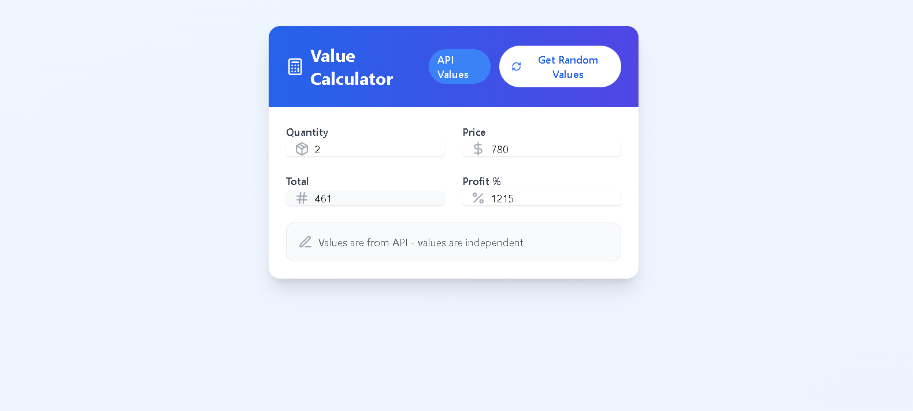

# Dynamic Form with API & Manual Input Handling

This project implements a form that:

- Receives random values from an API (values are independent)
- Allows manual input with dynamic calculations (linked fields update based on user input)

## Preview



## Features

- Fetches random values from an API (no calculations applied)
- Allows manual input with real-time recalculations
- UI differentiates between API-generated and user-modified values
- Dynamic updates:
  - Total = Quantity × Price (when manually updated)
  - Profit remains unchanged unless modified manually


### Frontend:

- Next.js (React, TypeScript) – UI and state management
- Tailwind CSS – Styling

## Installation & Setup

1. **Clone the repository**

```bash
git clone https://github.com/Priyanshuraj21030/Homely
```

2. **Install dependencies**

```bash
cd project
npm install
```

3. **Run the development server**

```bash
npm run dev
```

## Usage

1. Click "Fetch API Data" to get random values (static display)
2. Manually update values in fields:
   - Changing Quantity or Price recalculates Total
   - Profit remains unchanged unless edited
   - UI dynamically updates linked fields when necessary

